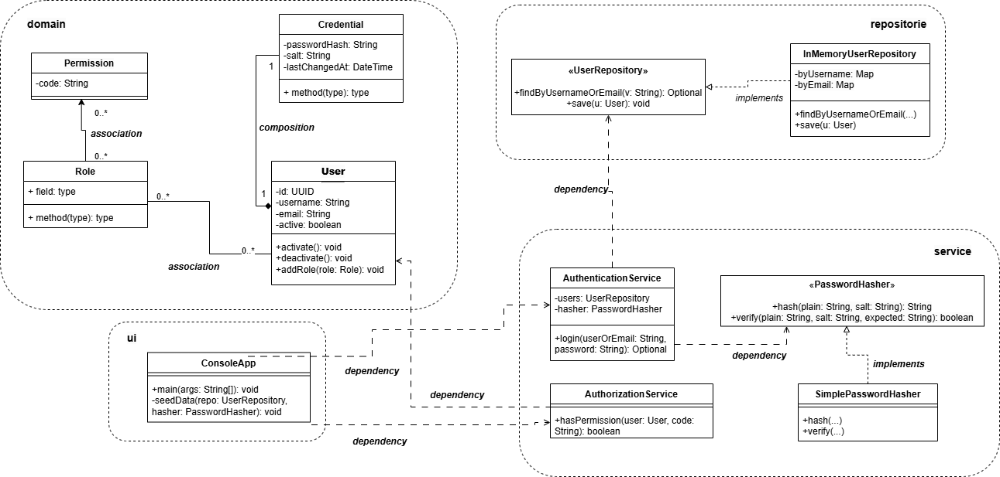

# OOP Auth Model — .NET (Console)

A small **.NET console application** that implements a simplified **authentication + authorization** model (similar in spirit to an Identity Server).  
This repository demonstrates **Object-Oriented Programming (OOP)** and a clean separation of responsibilities using a **multi-project solution**.

## Features
- Login using **username or email + password**
- Role-based access control (RBAC): **Users → Roles → Permissions**
- Permission checks (e.g., `CATALOG_UPDATE`)
- In-memory persistence (no database required)
- Clean structure: Domain / Repositories / Services / Console UI

## UML Design



## Solution Structure
```text
oop-auth-model-dotnet/
├── OopAuthModel.slnx
├── README.md
├── docs/
│   └── uml/
│       └── auth-model.png
└── src/
    ├── OopAuthModel.Console/
    ├── OopAuthModel.Domain/
    ├── OopAuthModel.Repositories/
    └── OopAuthModel.Services/